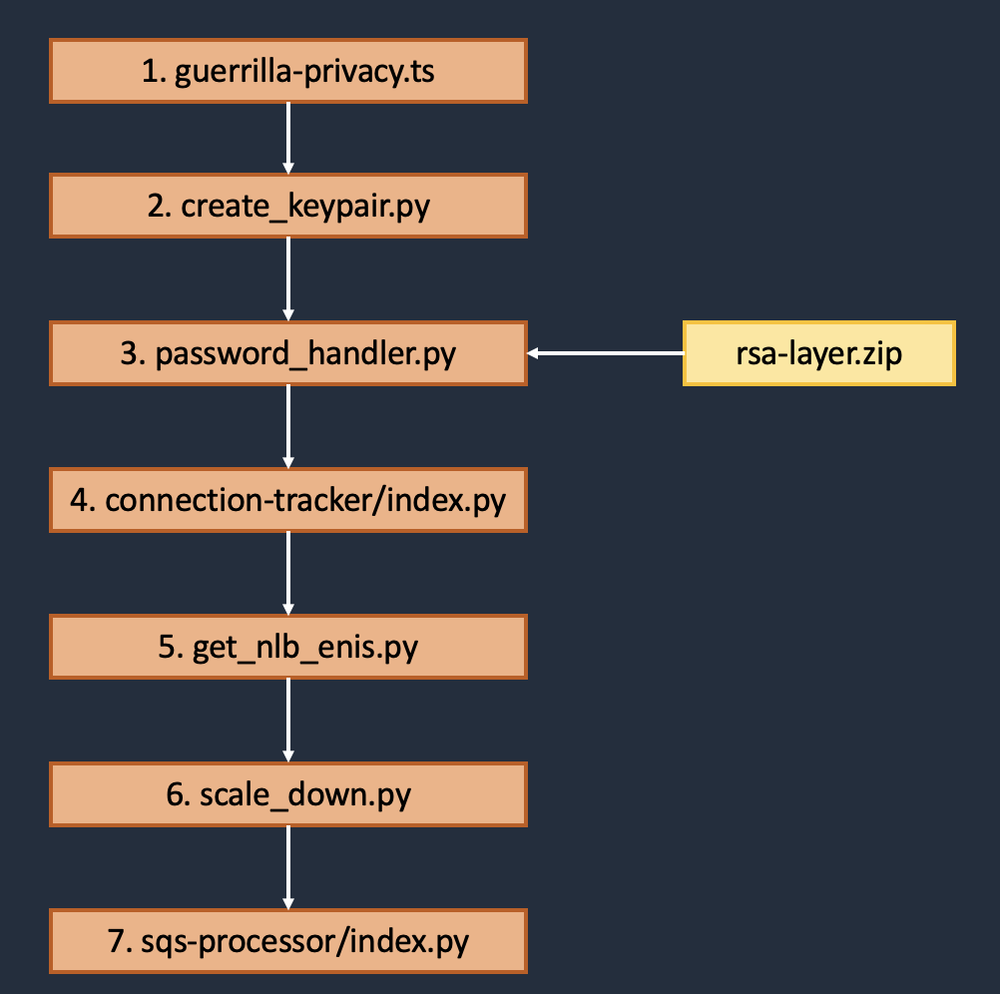
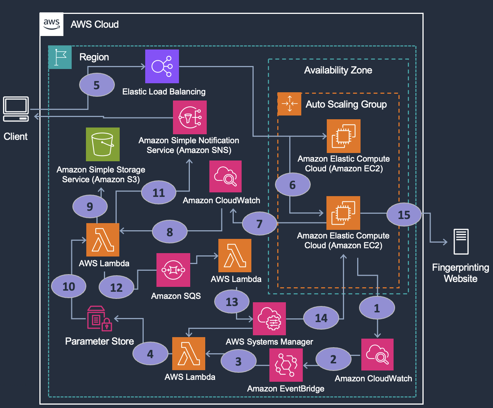

## Disclaimer 

This code has **NOT** undergone an official security review and was created for a Johns Hopkins University cloud security course as a proof of concept to see if device fingerprinting techniques would pull identifiers for cloud VMs rather than client device identifiers. It is highly recommended to conduct your own security review before deploying the guerrilla privacy application. 

# Guerrilla Privacy Application

Today's device fingerprinting mechanisms allow entities to track users across the Web, often without end users' knowledge or consent. Device and browser fingerprinting is nearly impossible to overcome and requires a mixture of privacy-enhanced browsers, Virtual Private Networks (VPNs), and other masking techniques to reduce detection. Unfortunately, adding such protections either creates signatures of their own for fingerprinting technologies or destroys the user's accessibility to websites.

We propose a new mechanism for masking one's web identity by leveraging cloud compute resources and the fundamentals of guerrilla and maneuver warfare to allow users to privately browse the Internet. By using cloud-based virtual machines (VM), the VM will be fingerprinted instead of the end-user's personal device, giving privacy back to the end user. Drawing on the concepts of constantly maneuvering to create a rapidly deteriorating situation for an enemy as taught by United States Marine Corps doctrine, we explore terminating and creating new virtual instances for browsing sessions with the expectation that a new device/browser ID is generated, making an individual end user appear as multiple entities/devices from different parts of the world. 

## SECURITY NOTES!!
* Ensure you update the instance security group and SNS email in the guerrilla-privacy.ts file. You can ctrl+F "//UPDATE THE IP ADDRESS" and 'UPDATE-WITH-YOUR-EMAIL@email.com' to find the security group and SNS configurations that need to be changed. 
* While it is unlikely for compromised EC2s to pose a significant threat as they are automatically terminated, you will likely receive a high rate of false positive emails due to malicious attempts to RDP into EC2s if the security group is set to 0.0.0.0/0 (open to the internet). Instead, it is recommended to set the security group to the public subnet for the network you are using to connect to the NLB. 

## Architecture

#### Deploying the Infrastructure

1. The first step is deploying the IaC (primary file is guerrilla-privacy.ts). Within the IaC, numerous Lambda functions are created and many of these Lambdas are only ran during initial IaC deployment. The code for the lambda functions can be found in the src/lambda directory. 
2. When the CDK is deployed, the master key pair is stored into Parameter Store via the create_keypair.py Lambda. This allows the key pair to be utilized later to decrypt the Windows admin password and store it into Parameter Store. 
---The Following Lambdas Are Deployed But Not Ran---
3. The get_nlb_enis.py lambda retrieves the enis associated with the NLB after it is deployed. This helps to prevent false positives during the use of the application as it aallows for listening of public IPs coming from the NLB rather than those potentially going to Microsoft for licensing checks.  
---The Following Lambda Is Actually Ran---
4. In the guerrilla-privacy.ts file, the EC2 Autoscaling group is initially set to have a minimum, desired, and maximum number of VMs set to 2. To get the first set of EC2 Window's passwords into Parameter Store, the scaleDownLambda function is ran. The function sets the EC2 minimum, desired, and maximum number to 0. By changing the autoscaling group's settings, the provisioned EC2s are terminated. The EC2 minimum, desired, and maximum number is then set back to 2 (in the scaleDownLambda function), provisioning a new set of EC2s. Since Parameter Store and the Key Pair have been created at this point, the Windows admin passwords for the newly provisioned EC2s are written into Parameter store.... Writing of the Window's passwords into Parameter Store starts at 1 in the architectural diagram. 
5. The password_handler.py Lambda is deployed, which will be used at a later time to retrieve the EC2 Windows admin password. This function relies on the rsa-layer.zip file, which holds the libraries for rsa encryption/decryption.
6. Once the initial deployment occurs, the below steps are followed for the remainder of the time. 


##### NOTE: This architecture is deployed in Amazon Web Services (AWS) using the AWS Cloud Development Kit (CDK). 

#### Storing of EC2 Passwords
1. The EC2s exist in an Auto-Scaling Group with the desired, maximum, and minimum number of EC2s set to (2). When an EC2 is created an CloudWatch Event is created for 'EC2 Instance Launch Successful', 'EC2 Instance-launch Lifecycle Action', 'Auto Scaling Instance Launch Successful'. 
2. An EventBridge rule listens for such CloudWatch events
3. When the rule is met, the password_handler.py Lambda is triggered. 
- Under the hood, password_handler.py calls SSM and SSM retrieves the encrypted password data for the newly created EC2. 
- The password data is then decrypted leveraging the lamba-layer/rsa-layer.zip Lambda layer and the master key pair (see step 2 of "Deploying the Infrastructure").
4. The plaintext Windows password is then stored securely into Parameter Store as a Secure String. 


#### User Connects To EC2 For Browsing Session
5. The end user specifies the DNS name (found under AWS Management Console -> EC2 -> Load Balancing) and clicks to connect to the Network Load Balancer (NLB). 
6. The NLB sends the RDP connection to one of the two healthy EC2 instances in the auto-scaling target group, which establishes a RDP connection behind the scenes.
- NOTE: A RDP CONNECTION TO THE EC2 HAS BEEN ESTABLISHED, BUT THE USER HAS NOT AUTHENTICATED. THE NEXT STEPS ALLOW FOR USER AUTHENTICATION. IN THE RDP APPLICATION, THIS WILL LOOK LIKE THE RDP CLIENT REQUESTING THE USERNAME/PASSWORD. THIS IS EXPECTED BEHAVIOR. 


#### User Receives EC2 Password for EC2 Authentication
7. EC2 flow logs are written into the CloudWatch Log Group named "/vpc/nlb-connections" for each Elastic Network Interface for the NLB and EC2s. 
8. A CloudWatch filter is setup to monitor for when an RDP connection is created and the destination IP is public and on dstport = 3389.
- NOTE: this filter monitors for responses sent over RDP. As an interesting exercise, you can review the ENI flow logs associated with your NLB to see hacking attempts against your environment. As long as your EC2 security group is not overly permissive, you do not need to worry about your EC2s being compromised as the security group will serve as your virtual firewall for your EC2. 
9. When a public IP connects to the EC2, the connection-tracker/index.py is ran which makes sure the RDP connection is going to the EC2 (by checking the ENI) rather than the NLB. Additionally, a call to S3, instanceFlagsBucket, is made. The S3 bucket, instanceFlagsBucket, serves as a makeshift means to validate no connections have been attempted to the EC2 to avoid duplicate connections. When a connection is made to an EC2, the instance ID for the connection is written into the S3 buckets with the .txt file being named after the instance ID. If the instance ID already exists in S3, then the remaining steps (10-14) do not run. This makes for an easy/cheap method for tracking which EC2s have had a RDP connection established. 
10. If the connection is a public IP, the ENI is tied to an EC2, and the S3 flag is NOT found, then the EC2 Windows password is retrieved from Parameter Store and published to SNS. 
11. SNS then sends the Windows password to the user via email. 


#### Automatically Terminating the EC2 After 15 Minutes
12. Before the connection-tracker/index.py Lambda function ends, it sends the instance ID metadata to a delay queue in SQS. After 15 minutes, the SQS queue sends the metadata to the sqs-processor/index.py Lambda. 
13. The sqs-processor/index.py calls to Systems Manager and provides the EC2 metadata. 
14. Systems Manager terminates the EC2 that the user is connected to based on the EC2 metadata. 


## Pre-reqs
The Guerrilla Privacy application requires the following software/tools:
* An active AWS Account
* AWS CDK
* node.js / npm
* Python3
* RSA Encyrption Package (within src directory)
* Microsoft Remote Desktop application

## Deployment

> **Note**
>
> The Guerrilla Privacy application is written for deployment to the **us-east-1** region.  

1. Configure your AWS CLI with the AWS Account you will use to deploy this application.

2. Install the project dependencies
```bash
npm install
```

3. In the root directory of the repository there is a file called **make-env**. This file contains environment variables that the project uses to follow naming conventions specific to this environment, and to understand the deployment region. 
```bash 
export APP_NAME:=guerrilla-privacy
export ENV_NAME:=prod-env
export AWS_REGION:=us-east-1
```   
4. In the **/config** folder you will find an **prod-env.configuration.yaml** file. Replace the email value in this file with your email. This file is where you may put values such as service specific configuration.

5. Make sure you're in the root directory of the project and deploy the project with the following make commands.
```bash
make deploy-cdk2-bootstrap-cf-stack
make deploy-infra
```
You can look at the Makefile in the parent directory for comments on what each command does. 

## Establishing the RDP Connection 
- Specify the DNS name (found under AWS Management Console -> EC2 -> Load Balancing) and click to connect to the Network Load Balancer (NLB). This will load balance you to an EC2.
- You will be prompted for credentials to login to the EC2. At this point, you have established a RDP connection.
- A log will be sent to CloudWatch showing that a public IP has connected to the EC2 instance. This eventually will trigger an email with the password to the EC2 to be sent to the email address specified in guerrilla-privacy.ts.
- Use the below log in instructions to log into the EC2.
- An example email is shown below. The last line of JSON is the instance password. Do not include the double quotes in the password. 
```JSON
{
  "timestamp": "2025-03-22T01:24:39.217882",
  "source_ip": "10.0.213.193",
  "destination_ip": "73.123.345.567",
  "instance_id": "i-07a5a0365b74c778f",
  "interface_id": "eni-0cca54603032f67ba",
  "connection_type": "RDP",
  "nlb_dns": "guerri-RDPNL-pWFF82r3zjcQ-436b5e8da1d32598.elb.us-east-1.amazonaws.com",
  "vpc_id": "vpc-0b72de73c41220288",
  "eni_instance_id": "i-07a5a0365b74c778f",
  "instance_password": "S@L5-!fYA3SkTmnzg4tSWGh4;P(rlQ$C"
}
```
- Note: At the end of the workflow that sends the password to your email, you have (15) minutes to login and browse before this instance is terminated.

## Logging In 
- Username: Administrator
- Password: You will receive the password for the EC2 via the email you specify in guerrilla-privacy.ts file for the SNS topic.  

## Testing Correctness
There are a few free fingerprinting providers
- https://amiunique.com
- https://fingerprint.com
- https://abrahamjuliot.github.io/creepjs/
- https://broprintjs.netlify.app
- https://coveryourtrackers.eff.org/

The VM being created is a Windows Server OS. The region is in us-east-1 (N. Virginia). If you are using a Mac, your fingerprint via the RDP connection will show as a Windows OS and coming from AWS, rather than your Mac. Since the same AMI is used between VMs, similar fingerprint attributes should be observed between VMs. 
